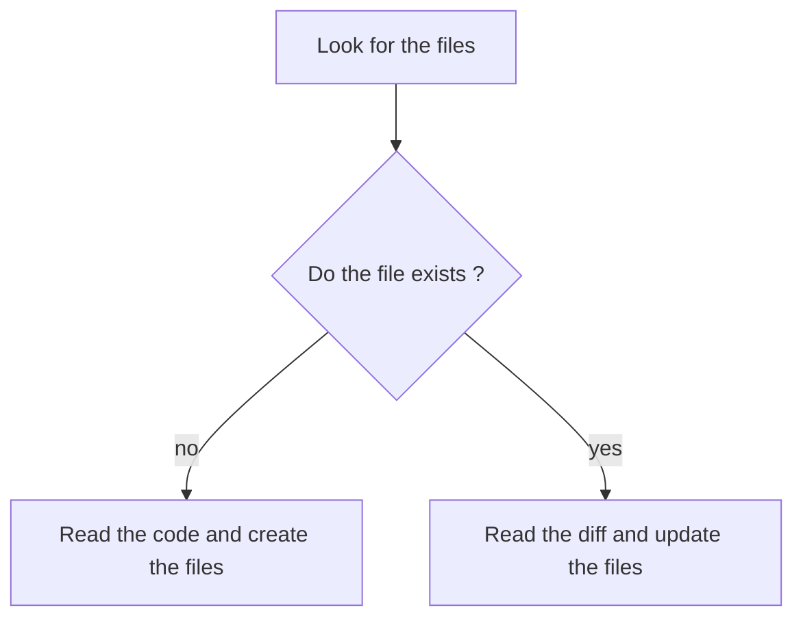

**IMPORTANT**
As an LLM Agent every new session your knowledge of the project completely resets.
The Documentation is the only link to previous work. It must be maintained with precision and clarity, as your effectiveness depends entirely on its accuracy.

## Documentation Structure 

The Main Documentation consists of two core files, in Markdown format.

This directory structure must be always present, relative to the component under scrutiny:
```
...
└──docs/
   ├── projectBrief.md
   └── systemPatterns.md
```

## Core Files

1. `projectBrief.md` is:
   - Foundation document
   - Defines core requirements and goals
   - Problems the project solves
   - User experience goals
   - Source of truth for project scope
   `projectBrief.md` is not about:
   - Technicalities, detail only the business logic and requisites
   - Implementations, contains only info about the why, not the how

   EXAMPLE STRUCTURE:
   ```projectBrief.md
   # Project Brief @ [current git commit hash]

   # Description:
   [ brief "elevator pitch" description of the project ]

   # Business Domains
   [ detailed descriptions about the business domains involved ]

   # Problems Solved
   [ detailed descriptions of the problems the project aims to solve inside the business domains ]

   # Domain glossary
   [ spefic domain glossary of elements found in the code ]
   ```

2. `systemPatterns.md` is:
   - System architecture
   - Key technical decisions
   - Design patterns in use
   - Component relationships
   - Critical implementation paths
   `systemPatterns.md` is not about:
   - Business, detail only the code architecture choices
   - Motivations, contains info about the how, not the why
   - Does not explain the tooling, only the technical choices 

   EXAMPLE STRUCTURE:
   ```systemPatterns.md
   # System Patterns @ [current git commit hash]

   # Source Structure
   [ representation of the directory structure with brief description of the contained logics / components ]

   # Software Architecture Diagram
   [ mermaid diagram detailing the relationships between identified components ]

   # Domain Models Diagram
   [ mermaid diagram detailing ORM / Pydantic objects and their relationships ]

   # Key Design Patterns
   [ list of the identified design patterns (only if non trivial) followed in the code, describe in detail each point ]
   ```


## When invoked follow this workflow :



### INIT workflow:
1.1. study the existing code with the aim to extrapolate info relevant to the projectBrief document
1.2. write the projectBrief.md document, following exactly the example structure
2. compact the session, informations about business goals can be forgotten
3.1. study again the existing code, now the aim is to extrapolate info relevant to the systemPatterns document
3.2. write the systemPatterns.md document, following exactly the example structure


**NOTES**
- When an inline graph is needed, use the mermaid standard.
- This is a highly interactive session, ask the user whenever you feel it is necessary
